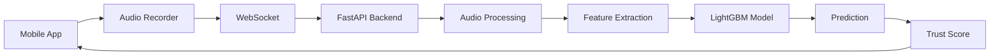
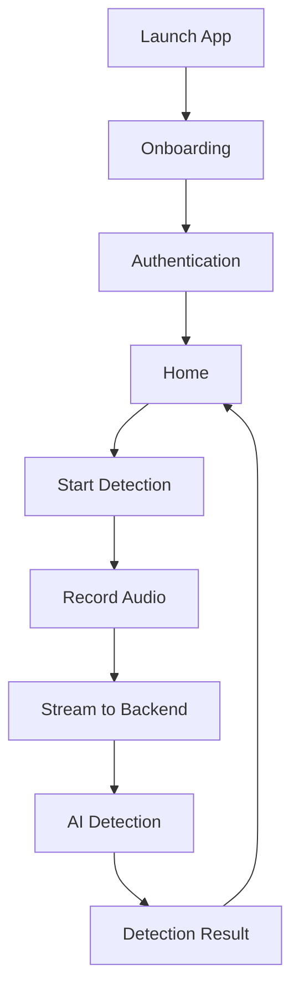
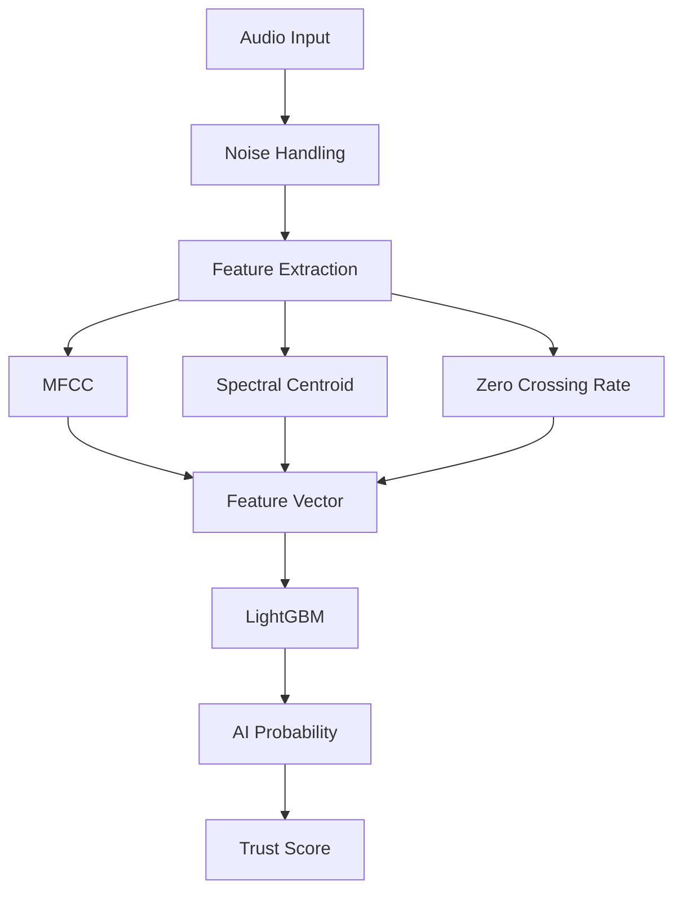

# 🎙️ TruVoice – AI-Powered Real-Time Voice Scam Detection

<p align="center">
  <strong>Detect AI-generated voices. Protect conversations. Build trust.</strong>
</p>

<p align="center">
  
  
  
  
  
  
</p>

---

## 📖 Overview

**TruVoice** is an AI-powered mobile application that detects **AI-generated, cloned, and manipulated voices in real time** during phone conversations.

With the rapid rise of voice cloning technologies, distinguishing between genuine and synthetic voices has become increasingly difficult. TruVoice continuously analyzes live audio streams using machine learning and digital signal processing to provide users with an instant trust score, helping them identify potential scams before they become victims.

---

## 🚨 Problem Statement

AI voice cloning has made phone scams more convincing than ever.

Fraudsters can now mimic family members, friends, colleagues, or public figures within seconds, making traditional verification methods ineffective.

Current caller ID solutions only verify **who is calling**, not **whether the voice itself is authentic**.

**TruVoice solves this problem by analyzing the voice in real time and estimating the probability that it has been AI-generated.**

---

# ✨ Features

### 🎯 Real-Time AI Voice Detection

- Analyze live audio continuously
- Detect AI-generated and cloned voices
- Instant trust score generation

### 📊 Live Risk Analysis

- Confidence score
- AI probability
- Human probability
- Risk classification

### ⚡ Streaming Audio Pipeline

- Continuous audio processing
- Low latency inference
- WebSocket-based communication

### 📱 Beautiful Mobile Experience

- Modern React Native UI
- Real-time detection screens
- Smooth onboarding
- Cross-platform support

### 🔒 Privacy First

- Audio processed securely
- No unnecessary storage
- Secure API communication

---

# 🧠 How It Works

```text
Incoming Call
      │
      ▼
Audio Stream
      │
      ▼
Audio Chunking
(5-second windows)
      │
      ▼
Feature Extraction
(MFCC, Spectral Features)
      │
      ▼
LightGBM AI Model
      │
      ▼
AI Confidence Score
      │
      ▼
Live Result Display
```

---

# 🏗️ Architecture



---

# 📱 Application Flow



---

# 🛠️ Tech Stack

| Category | Technologies |
|-----------|--------------|
| **Mobile App** | React Native, Expo |
| **State Management** | Zustand |
| **Styling** | NativeWind, Tailwind CSS |
| **Backend** | FastAPI, Python |
| **Communication** | WebSockets |
| **Machine Learning** | LightGBM |
| **Audio Processing** | Librosa, NumPy |
| **Model Serialization** | Joblib |
| **Authentication** | JWT |
| **API Server** | Uvicorn |

---

# 📂 Project Structure

```text
TruVoice/
│
├── frontend/
│   ├── app/
│   ├── assets/
│   ├── components/
│   ├── screens/
│   ├── hooks/
│   └── services/
│
├── backend/
│   ├── models/
│   ├── routes/
│   ├── utils/
│   ├── ai/
│   ├── websocket/
│   └── main.py
│
└── README.md
```

---

# ⚙️ Installation

## Clone Repository

```bash
git clone https://github.com/yourusername/TruVoice.git

cd TruVoice
```

---

# Backend Setup

```bash
cd backend

python -m venv .venv

# Windows
.venv\Scripts\activate

# Linux/macOS
source .venv/bin/activate

pip install -r requirements.txt
```

Create a `.env`

```env
JWT_SECRET=your_secret

HOST=0.0.0.0

PORT=8000
```

Run server

```bash
uvicorn main:app --reload
```

---

# Frontend Setup

```bash
cd frontend

npm install
```

Create `.env`

```env
EXPO_PUBLIC_API_URL=http://YOUR_LOCAL_IP:8000
```

Run

```bash
npx expo start
```

---

# 📊 Detection Pipeline



---

# 🔥 Why TruVoice?

✅ Real-time AI voice scam detection

✅ Low latency streaming

✅ Machine learning powered

✅ Mobile-first experience

✅ Modern scalable architecture

✅ Cross-platform

✅ Secure communication

---

# 👨‍💻 Built With

- React Native
- Expo
- FastAPI
- Python
- LightGBM
- Librosa
- WebSockets
- NativeWind
- Tailwind CSS
- JWT

---

# ⭐ Support

If you found this project helpful, consider giving it a ⭐ on GitHub.

---

<p align="center">
Built with ❤️ to make phone conversations safer in the age of AI.
</p>